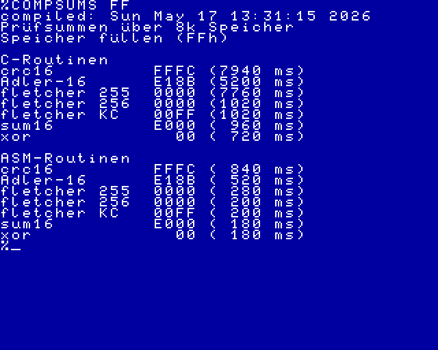

# KC85-Programm

Mit diesem Programm können die Prüfsummen auf dem KC85 evaluiert werden.

Getestet wird immer der Speicherbereich von 4000h bis 5FFFh.
Wird beim Programmaufruf ein Parameter (1 Byte) übergeben, wird der Speicherbereich mit diesem Byte gefüllt.

